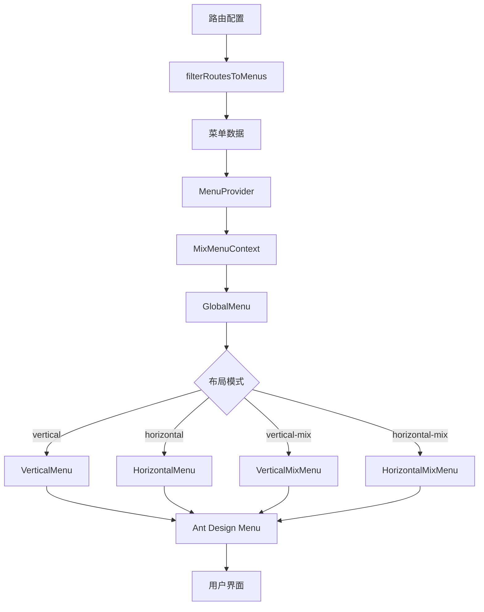

# 菜单系统

菜单系统是 skyroc-admin 的核心导航功能,提供了灵活的菜单配置、多种布局模式、权限控制和动态渲染等完整的菜单管理方案。

## 概述

菜单系统基于路由配置自动生成,支持多层级嵌套、图标显示、国际化、权限过滤等功能。主要特性包括:

- **自动生成**: 基于路由配置自动生成菜单树
- **多布局模式**: 支持垂直、水平、混合等多种布局
- **权限控制**: 根据用户权限自动过滤菜单
- **图标支持**: 支持 Iconify 图标和本地 SVG 图标
- **国际化**: 完整的多语言支持
- **智能排序**: 支持通过 `order` 字段控制菜单顺序
- **隐藏控制**: 支持隐藏特定菜单项
- **激活路由**: 支持指定激活的菜单项
- **侧边栏折叠**: 支持侧边栏展开/折叠功能
- **响应式**: 自动适配移动端和桌面端

## 架构设计



## 菜单数据结构

### Menu 类型

```ts
interface Menu {
  /** 菜单唯一标识,对应路由 path */
  key: string;
  /** 菜单显示文本 */
  label: React.ReactNode;
  /** 菜单标题(用于 tooltip) */
  title?: string;
  /** 菜单图标 */
  icon?: React.ReactElement;
  /** 国际化 key */
  i18nKey?: string | null;
  /** 子菜单 */
  children?: Menu[];
}
```

### 从路由配置生成菜单

菜单数据从路由配置的 `handle` 属性中提取:

```ts
// 路由配置
const route = {
  path: '/dashboard',
  component: Dashboard,
  handle: {
    title: '仪表盘',
    i18nKey: 'route.dashboard',
    icon: 'mdi:monitor-dashboard',
    localIcon: 'dashboard',  // 可选,本地 SVG 图标
    order: 1,                // 排序
    hideInMenu: false,       // 是否在菜单中隐藏
    activeMenu: '/dashboard' // 激活的菜单项
  }
};

// 生成的菜单
const menu: App.Global.Menu = {
  key: '/dashboard',
  label: <BeyondHiding title="仪表盘" />,
  title: '仪表盘',
  icon: <SvgIcon icon="mdi:monitor-dashboard" />,
  i18nKey: 'route.dashboard'
};
```

## 核心工具函数

### filterRoutesToMenus

从路由配置中过滤并生成菜单树。

```ts
import { filterRoutesToMenus } from '@/features/menu/MenuUtil';

// 从路由生成菜单
const routes = router.routes;
const menus = filterRoutesToMenus(routes);

console.log(menus);
// [
//   {
//     key: '/dashboard',
//     label: '仪表盘',
//     icon: <SvgIcon ... />
//   },
//   {
//     key: '/user',
//     label: '用户管理',
//     children: [...]
//   }
// ]
```

**过滤规则**:

1. 必须有 `path` 属性的路由才会生成菜单
2. `handle.hideInMenu === true` 的路由不会生成菜单
3. 没有 `path` 但有 `children` 的路由,会将子路由提升到当前层级
4. 自动递归处理多层级嵌套路由

### sortRoutesByOrder

根据 `handle.order` 对路由进行排序。

```ts
import { sortRoutesByOrder } from '@/features/menu/MenuUtil';

const routes = [
  { path: '/user', handle: { order: 2 } },
  { path: '/dashboard', handle: { order: 1 } },
  { path: '/settings', handle: { order: 3 } }
];

const sortedRoutes = sortRoutesByOrder(routes);
// [dashboard, user, settings]
```

**排序规则**:

- 按 `order` 数值从小到大排序
- 没有 `order` 的默认为 0
- 自动递归排序子路由

### getGlobalMenuByBaseRoute

从单个路由生成菜单项。

```ts
import { getGlobalMenuByBaseRoute } from '@/features/menu/MenuUtil';

const route = {
  path: '/dashboard',
  handle: {
    title: '仪表盘',
    i18nKey: 'route.dashboard',
    icon: 'mdi:monitor-dashboard'
  }
};

const menu = getGlobalMenuByBaseRoute(route);
// {
//   key: '/dashboard',
//   label: <BeyondHiding title="仪表盘" />,
//   title: '仪表盘',
//   icon: <SvgIcon icon="mdi:monitor-dashboard" />
// }
```

### getActiveFirstLevelMenuKey

获取当前路由对应的一级菜单 key。

```ts
import { getActiveFirstLevelMenuKey } from '@/features/menu/MenuUtil';
import { useRoute } from '@/features/router';

function MyComponent() {
  const route = useRoute();

  // 当前路由: /user/list/detail
  const firstLevelKey = getActiveFirstLevelMenuKey(route);
  // 返回: '/user'

  return <div>当前一级菜单: {firstLevelKey}</div>;
}
```

**工作原理**:

1. 如果路由隐藏(`hideInMenu: true`),使用 `activeMenu` 指定的路由
2. 从路由路径中提取第一级路径段
3. 用于混合布局模式下的一级菜单激活

### getSelectKey

获取当前路由应该激活的菜单 key。

```ts
import { getSelectKey } from '@/features/menu/MenuUtil';

const route = {
  pathname: '/user/detail',
  handle: {
    hideInMenu: true,
    activeMenu: '/user/list'
  }
};

const selectKey = getSelectKey(route);
// ['/user/list'] - 使用 activeMenu 指定的路由
```

### mergeMenus

合并菜单列表,用于动态添加菜单。

```ts
import { mergeMenus } from '@/features/menu/MenuUtil';

const existingMenus: App.Global.Menu[] = [
  { key: '/dashboard', label: '仪表盘' }
];

const newMenus: App.Global.Menu[] = [
  { key: '/user/profile', label: '个人中心' }
];

const mergedMenus = mergeMenus(existingMenus, newMenus);
// 自动将 /user/profile 合并到 /user 菜单下
```

## MenuProvider

菜单上下文提供者,为整个应用提供菜单数据和方法。

### 组件结构

```tsx
import MenuProvider from '@/features/menu/MenuProvider';

function App() {
  return (
    <MenuProvider>
      <Layout />
    </MenuProvider>
  );
}
```

### 提供的上下文

```ts
interface MixMenuContextProps {
  /** 当前激活的一级菜单 key */
  activeFirstLevelMenuKey: string;

  /** 所有菜单(完整菜单树) */
  allMenus: App.Global.Menu[];

  /** 当前一级菜单的子菜单 */
  childLevelMenus: App.Global.Menu[];

  /** 一级菜单列表(不含children) */
  firstLevelMenu: App.Global.Menu[];

  /** 当前激活的一级菜单是否有子菜单 */
  isActiveFirstLevelMenuHasChildren: boolean;

  /** 当前路由信息 */
  route: Router.Route;

  /** 当前应该激活的菜单 key 列表 */
  selectKey: string[];

  /** 设置激活的一级菜单 */
  setActiveFirstLevelMenuKey: (key?: string) => void;
}
```

### useMixMenuContext

访问菜单上下文的 Hook。

```tsx
import { useMixMenuContext } from '@/features/menu';

function CustomMenu() {
  const {
    allMenus,                              // 所有菜单
    firstLevelMenu,                        // 一级菜单
    childLevelMenus,                       // 子菜单
    activeFirstLevelMenuKey,               // 当前激活的一级菜单
    selectKey,                             // 当前选中的菜单
    setActiveFirstLevelMenuKey,            // 切换一级菜单
    isActiveFirstLevelMenuHasChildren      // 是否有子菜单
  } = useMixMenuContext();

  return (
    <div>
      <div>一级菜单数量: {firstLevelMenu.length}</div>
      <div>子菜单数量: {childLevelMenus?.length || 0}</div>
      <div>当前激活: {activeFirstLevelMenuKey}</div>
    </div>
  );
}
```

## GlobalMenu 组件

全局菜单组件,根据布局模式渲染不同的菜单样式。

### 组件使用

```tsx
import GlobalMenu from '@/layouts/modules/global-menu';
import { useThemeSettings } from '@/features/theme';

function Layout() {
  const themeSettings = useThemeSettings();

  return (
    <div>
      <GlobalMenu
        mode={themeSettings.layout.mode}
        reverse={themeSettings.layout.reverseHorizontalMix}
      />
    </div>
  );
}
```

### 支持的布局模式

#### 1. vertical - 垂直布局

```tsx
<GlobalMenu mode="vertical" reverse={false} />
```

**特点**:
- 菜单显示在左侧
- 支持多层级嵌套
- 支持展开/折叠
- 自动高亮当前路由

#### 2. horizontal - 水平布局

```tsx
<GlobalMenu mode="horizontal" reverse={false} />
```

**特点**:
- 菜单显示在顶部
- 支持多层级下拉菜单
- 适合一级菜单较少的场景

#### 3. vertical-mix - 垂直混合布局

```tsx
<GlobalMenu mode="vertical-mix" reverse={false} />
```

**特点**:
- 一级菜单在左侧
- 二级及以下菜单在主侧边栏
- 适合菜单项较多的场景

#### 4. horizontal-mix - 水平混合布局

```tsx
<GlobalMenu mode="horizontal-mix" reverse={false} />
```

**特点**:
- 一级菜单在顶部
- 二级及以下菜单在左侧
- 可通过 `reverse` 反转布局

#### 5. horizontal-mix (reversed) - 反转水平混合布局

```tsx
<GlobalMenu mode="horizontal-mix" reverse={true} />
```

**特点**:
- 二级菜单在左侧
- 一级菜单在顶部右侧
- 适合特殊布局需求

## VerticalMenu 组件

垂直菜单组件,用于侧边栏菜单渲染。

### 核心功能

```tsx
import VerticalMenu from '@/layouts/modules/global-menu/components/VerticalMenu';

// 在布局中使用
function Sidebar() {
  return (
    <div className="sidebar">
      <VerticalMenu />
    </div>
  );
}
```

### 特性

#### 1. 智能展开/折叠

```tsx
// 根据路由自动展开对应的菜单项
useEffect(() => {
  if (!inlineCollapsed) {
    const openKeys = getSelectedMenuKeyPath(route.matched);
    setStateOpenKeys(openKeys);
  }
}, [route, inlineCollapsed]);
```

#### 2. 只展开当前父级菜单

通过主题设置控制:

```ts
// themeSettings
{
  isOnlyExpandCurrentParentMenu: true  // 只展开当前层级
}
```

#### 3. 折叠状态

```tsx
const inlineCollapsed = useAppSelector(getSiderCollapse);

<AMenu
  inlineCollapsed={inlineCollapsed}
  inlineIndent={18}
  items={menus}
  mode="inline"
/>
```

#### 4. 混合布局模式

在混合布局下自动切换显示菜单:

```tsx
const isMix = themeSettings.layout.mode.includes('mix');

<AMenu
  items={isMix ? childLevelMenus : allMenus}
/>
```

## HorizontalMenu 组件

水平菜单组件,用于顶部导航栏。

### 显示模式

```tsx
enum HorizontalMenuMode {
  /** 所有菜单 */
  All = 'all',
  /** 仅一级菜单 */
  FirstLevel = 'first-level',
  /** 仅子菜单 */
  Child = 'child'
}
```

### 使用示例

```tsx
import HorizontalMenu from '@/layouts/modules/global-menu/components/HorizontalMenu';
import { HorizontalMenuMode } from '@/layouts/modules/global-menu/types';

// 显示所有菜单
<HorizontalMenu mode={HorizontalMenuMode.All} />

// 仅显示一级菜单
<HorizontalMenu mode={HorizontalMenuMode.FirstLevel} />

// 仅显示子菜单
<HorizontalMenu mode={HorizontalMenuMode.Child} />
```

### 一级菜单点击处理

```tsx
function handleClickMenu(menuInfo: MenuInfo) {
  // 如果是一级菜单且有子菜单,切换激活状态
  if (mode === HorizontalMenuMode.FirstLevel && isHasChildren(allMenus, menuInfo.key)) {
    setActiveFirstLevelMenuKey(menuInfo.key);
  } else {
    // 否则直接跳转
    navigate(menuInfo.key);
  }
}
```

## MenuToggler 组件

侧边栏折叠/展开按钮。

### 组件使用

```tsx
import MenuToggler from '@/features/menu/MenuToggler';

function Header() {
  return (
    <div className="header">
      <MenuToggler />
      {/* 其他头部内容 */}
    </div>
  );
}
```

### 图标样式

```tsx
// 默认图标(汉堡菜单样式)
<MenuToggler />

// 箭头图标样式
<MenuToggler arrowIcon />

// 自定义类名
<MenuToggler className="custom-toggle" />
```

### 图标状态

| 状态 | 默认图标 | 箭头图标 |
|------|---------|---------|
| 展开 | line-md:menu-fold-left | ph-caret-double-left-bold |
| 折叠 | line-md:menu-fold-right | ph-caret-double-right-bold |

## 路由配置与菜单

### 基础配置

```ts
const routes = [
  {
    path: '/dashboard',
    component: Dashboard,
    handle: {
      title: '仪表盘',
      i18nKey: 'route.dashboard',
      icon: 'mdi:monitor-dashboard',
      order: 1
    }
  }
];
```

### 菜单排序

```ts
const routes = [
  {
    path: '/user',
    handle: {
      title: '用户管理',
      order: 2  // 第二个显示
    }
  },
  {
    path: '/dashboard',
    handle: {
      title: '仪表盘',
      order: 1  // 第一个显示
    }
  }
];
```

### 隐藏菜单

```ts
const routes = [
  {
    path: '/user/detail',
    component: UserDetail,
    handle: {
      title: '用户详情',
      hideInMenu: true  // 不在菜单中显示
    }
  }
];
```

### 指定激活菜单

当详情页隐藏时,可以指定激活父级菜单:

```ts
const routes = [
  {
    path: '/user/list',
    component: UserList,
    handle: {
      title: '用户列表'
    }
  },
  {
    path: '/user/detail',
    component: UserDetail,
    handle: {
      title: '用户详情',
      hideInMenu: true,
      activeMenu: '/user/list'  // 激活用户列表菜单
    }
  }
];
```

### 多级嵌套菜单

```ts
const routes = [
  {
    path: '/system',
    handle: {
      title: '系统管理',
      icon: 'carbon:settings',
      order: 99
    },
    children: [
      {
        path: 'user',
        handle: {
          title: '用户管理',
          icon: 'ph:user-circle'
        },
        children: [
          {
            path: 'list',
            component: UserList,
            handle: {
              title: '用户列表'
            }
          },
          {
            path: 'role',
            component: UserRole,
            handle: {
              title: '角色管理'
            }
          }
        ]
      },
      {
        path: 'menu',
        component: MenuManage,
        handle: {
          title: '菜单管理',
          icon: 'material-symbols:menu'
        }
      }
    ]
  }
];
```

### 外部链接菜单

```ts
const routes = [
  {
    path: '/external',
    handle: {
      title: '外部链接',
      icon: 'mdi:link-variant',
      href: 'https://example.com',  // 外部链接
      order: 100
    }
  }
];
```

## 实际应用场景

### 1. 动态菜单权限过滤

```tsx
import { filterRoutesToMenus } from '@/features/menu/MenuUtil';
import { useAuth } from '@/features/auth';

function useFilteredMenus() {
  const { hasAuth } = useAuth();
  const router = useRouter();

  const menus = useMemo(() => {
    const allMenus = filterRoutesToMenus(router.reactRouter.routes);

    // 递归过滤无权限的菜单
    function filterByAuth(menuList: App.Global.Menu[]): App.Global.Menu[] {
      return menuList.filter(menu => {
        const routeKey = menu.key.replace('/', '');

        // 检查权限
        if (!hasAuth(routeKey)) {
          return false;
        }

        // 递归过滤子菜单
        if (menu.children) {
          menu.children = filterByAuth(menu.children);
        }

        return true;
      });
    }

    return filterByAuth(allMenus);
  }, [router.reactRouter.routes, hasAuth]);

  return menus;
}
```

### 2. 动态添加菜单

```tsx
import { mergeMenus } from '@/features/menu/MenuUtil';

function useDynamicMenus() {
  const [additionalMenus, setAdditionalMenus] = useState<App.Global.Menu[]>([]);

  const baseMenus = filterRoutesToMenus(routes);

  // 从后端获取额外菜单
  useEffect(() => {
    fetchDynamicMenus().then(data => {
      setAdditionalMenus(data);
    });
  }, []);

  // 合并菜单
  const finalMenus = useMemo(() => {
    return mergeMenus([...baseMenus], additionalMenus);
  }, [baseMenus, additionalMenus]);

  return finalMenus;
}
```

### 3. 自定义菜单渲染

```tsx
import { useMixMenuContext } from '@/features/menu';

function CustomMenuRender() {
  const { allMenus } = useMixMenuContext();

  const renderMenu = (menu: App.Global.Menu) => {
    return (
      <div key={menu.key} className="custom-menu-item">
        {menu.icon}
        <span>{menu.label}</span>
        {menu.children && (
          <div className="submenu">
            {menu.children.map(renderMenu)}
          </div>
        )}
      </div>
    );
  };

  return (
    <div className="custom-menu">
      {allMenus.map(renderMenu)}
    </div>
  );
}
```

### 4. 面包屑导航

```tsx
import { useMixMenuContext } from '@/features/menu';

function Breadcrumb() {
  const { route, allMenus } = useMixMenuContext();

  // 根据当前路由生成面包屑
  const breadcrumbs = useMemo(() => {
    const paths = route.pathname.split('/').filter(Boolean);
    const items: App.Global.Breadcrumb[] = [];

    let currentPath = '';
    for (const path of paths) {
      currentPath += `/${path}`;

      // 从菜单中查找对应项
      const menuItem = findMenuByPath(allMenus, currentPath);
      if (menuItem) {
        items.push({
          key: menuItem.key,
          label: menuItem.label,
          title: menuItem.title
        });
      }
    }

    return items;
  }, [route.pathname, allMenus]);

  return (
    <div className="breadcrumb">
      {breadcrumbs.map((item, index) => (
        <span key={item.key}>
          {item.label}
          {index < breadcrumbs.length - 1 && <span> / </span>}
        </span>
      ))}
    </div>
  );
}

function findMenuByPath(menus: App.Global.Menu[], path: string): App.Global.Menu | null {
  for (const menu of menus) {
    if (menu.key === path) return menu;
    if (menu.children) {
      const found = findMenuByPath(menu.children, path);
      if (found) return found;
    }
  }
  return null;
}
```

### 5. 菜单搜索

```tsx
import { useMixMenuContext } from '@/features/menu';

function MenuSearch() {
  const { allMenus } = useMixMenuContext();
  const [keyword, setKeyword] = useState('');
  const { navigate } = useRouter();

  // 扁平化所有菜单
  const flatMenus = useMemo(() => {
    const result: App.Global.Menu[] = [];

    function flatten(menus: App.Global.Menu[]) {
      for (const menu of menus) {
        result.push(menu);
        if (menu.children) {
          flatten(menu.children);
        }
      }
    }

    flatten(allMenus);
    return result;
  }, [allMenus]);

  // 搜索菜单
  const searchResults = useMemo(() => {
    if (!keyword) return [];

    return flatMenus.filter(menu => {
      const title = menu.title?.toLowerCase() || '';
      const key = menu.key.toLowerCase();
      const search = keyword.toLowerCase();

      return title.includes(search) || key.includes(search);
    });
  }, [keyword, flatMenus]);

  return (
    <div className="menu-search">
      <input
        placeholder="搜索菜单..."
        value={keyword}
        onChange={e => setKeyword(e.target.value)}
      />
      <div className="search-results">
        {searchResults.map(menu => (
          <div
            key={menu.key}
            className="result-item"
            onClick={() => navigate(menu.key)}
          >
            {menu.icon}
            <span>{menu.title}</span>
          </div>
        ))}
      </div>
    </div>
  );
}
```

### 6. 菜单统计

```tsx
function useMenuStats() {
  const { allMenus } = useMixMenuContext();

  const stats = useMemo(() => {
    let totalCount = 0;
    let maxDepth = 0;

    function traverse(menus: App.Global.Menu[], depth: number = 1) {
      totalCount += menus.length;
      maxDepth = Math.max(maxDepth, depth);

      for (const menu of menus) {
        if (menu.children) {
          traverse(menu.children, depth + 1);
        }
      }
    }

    traverse(allMenus);

    return {
      totalCount,    // 总菜单数
      maxDepth,      // 最大层级
      firstLevel: allMenus.length  // 一级菜单数
    };
  }, [allMenus]);

  return stats;
}
```

## 主题配置

### 侧边栏设置

```ts
interface ThemeSiderSettings {
  /** 侧边栏宽度 */
  width: number;
  /** 折叠后宽度 */
  collapsedWidth: number;
  /** 混合布局一级菜单宽度 */
  mixWidth: number;
  /** 混合布局二级菜单宽度 */
  mixChildMenuWidth: number;
  /** 混合布局折叠宽度 */
  mixCollapsedWidth: number;
  /** 反色侧边栏 */
  inverted: boolean;
}

// 默认配置
const defaultSiderSettings: ThemeSiderSettings = {
  width: 220,
  collapsedWidth: 64,
  mixWidth: 90,
  mixChildMenuWidth: 200,
  mixCollapsedWidth: 48,
  inverted: false
};
```

### 布局模式设置

```ts
interface ThemeLayoutSettings {
  /** 布局模式 */
  mode: 'vertical' | 'horizontal' | 'vertical-mix' | 'horizontal-mix';
  /** 是否反转水平混合布局 */
  reverseHorizontalMix: boolean;
  /** 滚动模式 */
  scrollMode: 'content' | 'wrapper';
}
```

### 菜单行为设置

```ts
interface ThemeMenuSettings {
  /** 是否只展开当前父级菜单 */
  isOnlyExpandCurrentParentMenu: boolean;
}
```

## 性能优化

### 1. 菜单数据缓存

```tsx
import { useMemo } from 'react';

function MenuProvider({ children }: PropsWithChildren) {
  const router = useRouter();
  const { locale } = useLang();

  // 缓存菜单生成结果,只在路由或语言变化时重新生成
  const menus = useMemo(
    () => filterRoutesToMenus(router.reactRouter.routes),
    [router.reactRouter.routes, locale]
  );

  return <MixMenuContext value={{ menus }}>{children}</MixMenuContext>;
}
```

### 2. 菜单项懒渲染

```tsx
function LazyMenuItem({ menu }: { menu: App.Global.Menu }) {
  const [isVisible, setIsVisible] = useState(false);

  useEffect(() => {
    const timer = setTimeout(() => setIsVisible(true), 0);
    return () => clearTimeout(timer);
  }, []);

  if (!isVisible) {
    return <MenuItemSkeleton />;
  }

  return <MenuItem menu={menu} />;
}
```

### 3. 虚拟滚动(大量菜单项)

```tsx
import { useVirtualizer } from '@tanstack/react-virtual';

function VirtualMenuList({ menus }: { menus: App.Global.Menu[] }) {
  const parentRef = useRef<HTMLDivElement>(null);

  const rowVirtualizer = useVirtualizer({
    count: menus.length,
    getScrollElement: () => parentRef.current,
    estimateSize: () => 40
  });

  return (
    <div ref={parentRef} style={{ height: '100%', overflow: 'auto' }}>
      <div style={{ height: `${rowVirtualizer.getTotalSize()}px` }}>
        {rowVirtualizer.getVirtualItems().map(virtualItem => {
          const menu = menus[virtualItem.index];
          return (
            <div
              key={menu.key}
              style={{
                position: 'absolute',
                top: 0,
                left: 0,
                width: '100%',
                height: `${virtualItem.size}px`,
                transform: `translateY(${virtualItem.start}px)`
              }}
            >
              <MenuItem menu={menu} />
            </div>
          );
        })}
      </div>
    </div>
  );
}
```

## 最佳实践

### 1. 合理设置菜单层级

避免过深的菜单嵌套:

```ts
// 推荐:最多 3 层
/system
  /system/user
    /system/user/list
    /system/user/role

// 不推荐:超过 3 层
/system
  /system/user
    /system/user/manage
      /system/user/manage/list
        /system/user/manage/list/detail  // 过深!
```

### 2. 使用语义化的路由路径

```ts
// 推荐
/user/list
/user/detail
/product/list
/product/detail

// 不推荐
/page1
/page2
/view1
```

### 3. 合理使用 order

为重要菜单设置较小的 order 值:

```ts
const routes = [
  { path: '/dashboard', handle: { order: 1 } },     // 首页
  { path: '/workspace', handle: { order: 2 } },     // 工作台
  { path: '/user', handle: { order: 10 } },         // 业务功能
  { path: '/system', handle: { order: 99 } }        // 系统设置
];
```

### 4. 详情页隐藏并指定激活菜单

```ts
// 列表页
{
  path: '/user/list',
  handle: { title: '用户列表' }
}

// 详情页
{
  path: '/user/detail',
  handle: {
    title: '用户详情',
    hideInMenu: true,
    activeMenu: '/user/list'  // 激活列表页菜单
  }
}
```

### 5. 图标一致性

使用统一的图标库:

```ts
// 推荐:统一使用 Iconify
{
  icon: 'mdi:account',
  icon: 'mdi:settings',
  icon: 'mdi:chart-box'
}

// 不推荐:混用多个图标库
{
  icon: 'mdi:account',       // Material Design Icons
  icon: 'fa:user',           // Font Awesome
  icon: 'ant-design:user'    // Ant Design Icons
}
```

## 国际化支持

### 配置国际化 key

```ts
const routes = [
  {
    path: '/dashboard',
    handle: {
      title: 'Dashboard',        // 默认英文
      i18nKey: 'route.dashboard' // 国际化 key
    }
  }
];
```

### 语言文件配置

```ts
// src/locales/zh-CN.ts
export default {
  route: {
    dashboard: '仪表盘',
    user: '用户管理',
    'user-list': '用户列表',
    'user-detail': '用户详情'
  }
};

// src/locales/en-US.ts
export default {
  route: {
    dashboard: 'Dashboard',
    user: 'User Management',
    'user-list': 'User List',
    'user-detail': 'User Detail'
  }
};
```

### 动态切换语言

```tsx
import { useLang } from '@/features/lang';

function LanguageSwitcher() {
  const { locale, changeLocale } = useLang();

  return (
    <select value={locale} onChange={e => changeLocale(e.target.value)}>
      <option value="zh-CN">简体中文</option>
      <option value="en-US">English</option>
    </select>
  );
}
```

## 相关文件

- **MenuUtil.tsx**: 菜单工具函数 (`/src/features/menu/MenuUtil.tsx:1`)
- **MenuProvider.tsx**: 菜单上下文提供者 (`/src/features/menu/MenuProvider.tsx:1`)
- **menuContext.ts**: 菜单上下文定义 (`/src/features/menu/menuContext.ts:1`)
- **MenuToggler.tsx**: 侧边栏折叠按钮 (`/src/features/menu/MenuToggler.tsx:1`)
- **GlobalMenu/index.tsx**: 全局菜单组件 (`/src/layouts/modules/global-menu/index.tsx:1`)
- **VerticalMenu.tsx**: 垂直菜单组件 (`/src/layouts/modules/global-menu/components/VerticalMenu.tsx:1`)
- **HorizontalMenu.tsx**: 水平菜单组件 (`/src/layouts/modules/global-menu/components/HorizontalMenu.tsx:1`)

## 相关文档

- [路由系统](../routes/page.mdx) - 路由配置基础
- [权限系统](../auth/page.mdx) - 菜单权限控制
- [国际化](../i18n/page.mdx) - 多语言配置
- [主题配置](../theme/page.mdx) - 布局和样式配置

## 总结

菜单系统提供了完整的导航解决方案:

- 基于路由配置自动生成菜单
- 支持 5 种布局模式
- 完善的权限控制
- 灵活的菜单配置选项
- 智能的展开/折叠逻辑
- 完整的国际化支持
- 丰富的自定义能力
- 优秀的性能表现

通过合理使用菜单系统,可以快速构建清晰、易用的导航体验。
