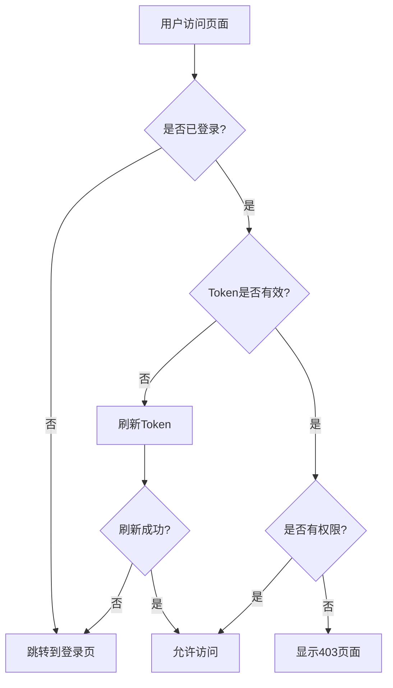

# 认证系统

认证系统是后台管理系统的核心模块,负责用户登录、权限验证、Token管理等功能。本框架提供了完整的认证解决方案,支持基于Token的身份验证和基于角色的访问控制(RBAC)。

## 核心特性

### 1. 基于Token的认证
- **Access Token**: 用于API请求的访问令牌
- **Refresh Token**: 用于刷新访问令牌
- **自动刷新**: Token过期时自动刷新

### 2. 用户信息管理
- 用户基本信息存储
- 用户角色管理
- 按钮权限管理

### 3. 权限控制
- **路由权限**: 基于角色的路由访问控制
- **按钮权限**: 基于权限码的按钮级控制
- **超级管理员**: 静态模式下的超级管理员支持

### 4. 状态管理
- Redux Toolkit状态管理
- LocalStorage持久化
- React Query缓存

### 5. 登录流程
- 用户名密码登录
- 登录成功跳转
- 登录失败处理
- 重定向支持

## 认证流程



## 认证状态

认证系统使用Redux管理全局认证状态:

```ts
interface AuthState {
  token: string;  // 访问令牌
}
```

### 状态存储

认证状态同时存储在两个地方:
1. **Redux Store**: 运行时状态,用于快速访问
2. **LocalStorage**: 持久化存储,用于页面刷新后恢复状态

## 核心API

### useAuth - 权限验证Hook

用于在组件中验证用户权限。

```tsx
import { useAuth } from '@/features/auth';

function MyComponent() {
  const { hasAuth, isStaticSuper } = useAuth();

  // 检查单个权限
  const canEdit = hasAuth('user:edit');

  // 检查多个权限(满足其一即可)
  const canManage = hasAuth(['user:edit', 'user:delete']);

  // 检查是否为超级管理员
  if (isStaticSuper) {
    // 超级管理员逻辑
  }

  return (
    <div>
      {canEdit && <button>编辑</button>}
      {canManage && <button>管理</button>}
    </div>
  );
}
```

### useInitAuth - 登录Hook

用于处理用户登录逻辑。

```tsx
import { useInitAuth } from '@/features/auth';

function LoginPage() {
  const { loading, toLogin } = useInitAuth();

  const handleLogin = async () => {
    await toLogin({
      userName: 'admin',
      password: '123456'
    });
  };

  return (
    <button onClick={handleLogin} loading={loading}>
      登录
    </button>
  );
}
```

### resetAuth - 退出登录

用于清除认证信息并退出登录。

```tsx
import { resetAuth } from '@/features/auth';

function LogoutButton() {
  const handleLogout = () => {
    resetAuth();
  };

  return <button onClick={handleLogout}>退出登录</button>;
}
```

## Token管理

### Token存储

Token存储在LocalStorage中:

```ts
// 存储Token
localStg.set('token', accessToken);
localStg.set('refreshToken', refreshToken);

// 获取Token
const token = localStg.get('token');
const refreshToken = localStg.get('refreshToken');

// 清除Token
localStg.remove('token');
localStg.remove('refreshToken');
```

### Token刷新

框架自动处理Token刷新逻辑,当API请求返回401时,会自动使用RefreshToken刷新AccessToken。

详见 [请求管理](/request) 文档。

## 用户信息

### 用户信息结构

```ts
interface UserInfo {
  userId: string;        // 用户ID
  userName: string;      // 用户名
  roles: string[];       // 角色列表
  buttons: string[];     // 按钮权限列表
}
```

### 获取用户信息

```tsx
import { useUserInfo } from '@/service/hooks';

function UserProfile() {
  const { data: userInfo, isLoading } = useUserInfo();

  if (isLoading) return <div>加载中...</div>;

  return (
    <div>
      <p>用户名: {userInfo?.userName}</p>
      <p>角色: {userInfo?.roles.join(', ')}</p>
    </div>
  );
}
```

## 权限验证

### 路由权限

路由权限通过路由守卫实现,在路由配置中设置`roles`字段:

```ts
{
  name: 'user-management',
  path: '/user',
  handle: {
    title: '用户管理',
    roles: ['admin', 'manager']  // 只有admin和manager角色可以访问
  }
}
```

详见 [路由守卫](/routes/guard) 文档。

### 按钮权限

按钮权限通过`useAuth` Hook验证:

```tsx
function UserManagement() {
  const { hasAuth } = useAuth();

  return (
    <div>
      {hasAuth('user:create') && (
        <button>新建用户</button>
      )}
      {hasAuth('user:edit') && (
        <button>编辑用户</button>
      )}
      {hasAuth(['user:delete', 'user:batch-delete']) && (
        <button>删除用户</button>
      )}
    </div>
  );
}
```

### 权限指令(推荐)

使用权限组件更优雅地控制元素显示:

```tsx
import { AuthButton } from '@/components';

function UserManagement() {
  return (
    <div>
      <AuthButton code="user:create">新建用户</AuthButton>
      <AuthButton code="user:edit">编辑用户</AuthButton>
      <AuthButton code={['user:delete', 'user:batch-delete']}>
        删除用户
      </AuthButton>
    </div>
  );
}
```

## 登录流程详解

### 1. 用户输入凭证

```tsx
const [form] = Form.useForm();

const handleSubmit = async (values: LoginForm) => {
  await toLogin({
    userName: values.username,
    password: values.password
  });
};
```

### 2. 调用登录API

```ts
// toLogin 内部实现
login(params, {
  onSuccess: async data => {
    // 存储Token
    localStg.set('token', data.token);
    localStg.set('refreshToken', data.refreshToken);

    // 获取用户信息
    const { data: info } = await refetchUserInfo();

    // 存储用户信息
    localStg.set('userInfo', info);

    // 更新Redux状态
    dispatch(setToken(data.token));

    // 跳转到目标页面
    replace(redirectUrl || globalConfig.homePath);
  }
});
```

### 3. 初始化路由

登录成功后,系统会根据认证模式初始化路由:

- **静态模式**: 根据用户角色过滤前端定义的路由
- **动态模式**: 从后端获取用户可访问的路由

详见 [路由初始化](/routes/init) 文档。

## 退出登录流程

### 退出登录步骤

```ts
export function resetAuth() {
  // 1. 清除认证存储
  clearAuthStorage();

  // 2. 重置认证状态
  store.dispatch(resetAuthAction());

  // 3. 清除标签页
  store.dispatch(clearTabs());

  // 4. 重置路由存储
  store.dispatch(resetRouteStore());

  // 5. 保存上一个用户ID
  const userInfo = getUserInfo();
  localStg.set('previousUserId', userInfo?.userId || '');

  // 6. 重置路由
  router.resetRoutes();

  // 7. 缓存标签页(如果启用)
  const themeSettings = getThemeSettings(store.getState());
  const tabs = selectTabs(store.getState());
  if (themeSettings.tab.cache) {
    localStg.set('globalTabs', tabs);
  }

  // 8. 清除查询缓存
  queryClient.clear();

  // 9. 跳转到登录页
  const currentPath = router.getPathname();
  if (!currentPath.includes('/login')) {
    router.push('/login', {
      query: { redirect: currentPath },
      replace: true
    });
  }
}
```

## 实际应用场景

### 1. 登录页面

```tsx
import { useInitAuth } from '@/features/auth';

export default function LoginPage() {
  const { loading, toLogin } = useInitAuth();
  const [form] = Form.useForm();

  const handleSubmit = async (values: LoginForm) => {
    await toLogin({
      userName: values.username,
      password: values.password
    });
  };

  return (
    <Form form={form} onFinish={handleSubmit}>
      <Form.Item name="username" rules={[{ required: true }]}>
        <Input placeholder="用户名" />
      </Form.Item>
      <Form.Item name="password" rules={[{ required: true }]}>
        <Input.Password placeholder="密码" />
      </Form.Item>
      <Button type="primary" htmlType="submit" loading={loading}>
        登录
      </Button>
    </Form>
  );
}
```

### 2. 用户信息显示

```tsx
import { useUserInfo } from '@/service/hooks';
import { resetAuth } from '@/features/auth';

function UserDropdown() {
  const { data: userInfo } = useUserInfo();

  const handleLogout = () => {
    Modal.confirm({
      title: '确认退出',
      content: '确定要退出登录吗?',
      onOk: resetAuth
    });
  };

  return (
    <Dropdown
      menu={{
        items: [
          {
            key: 'profile',
            label: '个人信息'
          },
          {
            key: 'logout',
            label: '退出登录',
            onClick: handleLogout
          }
        ]
      }}
    >
      <div>
        <Avatar src={userInfo?.avatar} />
        <span>{userInfo?.userName}</span>
      </div>
    </Dropdown>
  );
}
```

### 3. 权限控制的页面

```tsx
import { useAuth } from '@/features/auth';

function UserManagement() {
  const { hasAuth, isStaticSuper } = useAuth();

  const canCreate = hasAuth('user:create');
  const canEdit = hasAuth('user:edit');
  const canDelete = hasAuth('user:delete');

  return (
    <div>
      <div className="actions">
        {canCreate && <Button onClick={handleCreate}>新建</Button>}
        {isStaticSuper && <Button danger>超级管理员操作</Button>}
      </div>
      <Table
        columns={[
          // ...columns
          {
            title: '操作',
            render: (_, record) => (
              <>
                {canEdit && <Button onClick={() => handleEdit(record)}>编辑</Button>}
                {canDelete && <Button danger onClick={() => handleDelete(record)}>删除</Button>}
              </>
            )
          }
        ]}
      />
    </div>
  );
}
```

### 4. API请求中的Token

Token会自动添加到请求头中,无需手动处理:

```ts
// 请求拦截器自动添加Token
const token = getToken();
if (token) {
  config.headers.Authorization = `Bearer ${token}`;
}
```

详见 [请求管理](/request/usage) 文档。

## 最佳实践

### 1. Token安全

- ✅ 使用HTTPS传输Token
- ✅ Token存储在LocalStorage(HttpOnly Cookie更安全)
- ✅ 设置合理的Token过期时间
- ✅ 实现Token自动刷新
- ❌ 不要在URL中传递Token

### 2. 权限验证

- ✅ 在路由守卫中进行路由级权限验证
- ✅ 在组件中进行按钮级权限验证
- ✅ 在API层进行接口级权限验证
- ❌ 不要只依赖前端权限验证

### 3. 用户体验

- ✅ 登录成功后跳转到之前访问的页面
- ✅ Token过期时自动刷新,用户无感知
- ✅ 退出登录时清除所有用户数据
- ✅ 提供友好的权限不足提示

### 4. 状态管理

- ✅ 使用Redux管理运行时认证状态
- ✅ 使用LocalStorage持久化Token和用户信息
- ✅ 使用React Query缓存用户信息
- ❌ 不要在组件state中存储Token

## 认证模式

### 静态认证模式

适用于路由配置固定的场景,前端定义所有路由,后端只返回用户的角色信息。

**配置**:
```env
VITE_AUTH_ROUTE_MODE=static
VITE_STATIC_SUPER_ROLE=R_SUPER
```

**特点**:
- 路由在前端定义
- 根据用户角色过滤路由
- 支持超级管理员角色
- 部署后可直接使用

### 动态认证模式

适用于需要灵活配置路由的场景,后端返回用户可访问的完整路由配置。

**配置**:
```env
VITE_AUTH_ROUTE_MODE=dynamic
```

**特点**:
- 路由由后端返回
- 更灵活的权限控制
- 支持运行时修改路由
- 需要后端配合

详见 [路由初始化](/routes/init) 文档。

## 相关文档

- [路由守卫](/routes/guard) - 路由级权限控制
- [路由初始化](/routes/init) - 认证路由加载
- [请求管理](/request) - API请求与Token
- [Redux](/guide/redux) - 状态管理

## 总结

认证系统是整个应用的安全基础,本框架提供了：

- 完整的登录/退出流程
- 基于Token的身份验证
- 基于角色和权限码的访问控制
- 静态和动态两种认证模式
- 完善的状态管理和持久化
- 友好的用户体验

通过合理使用认证系统的各项功能,可以构建安全可靠的后台管理应用。
