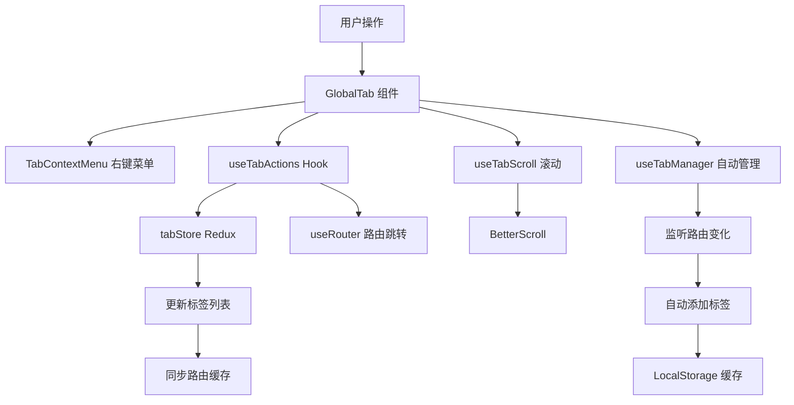
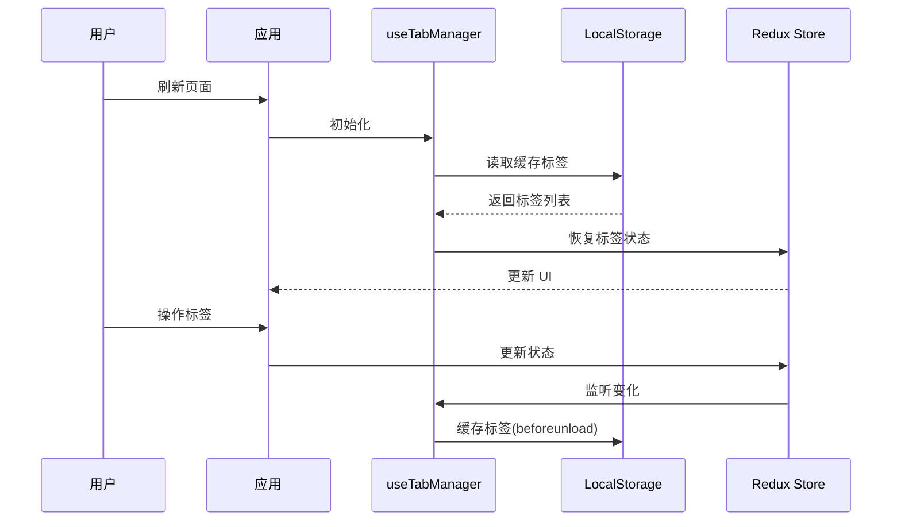
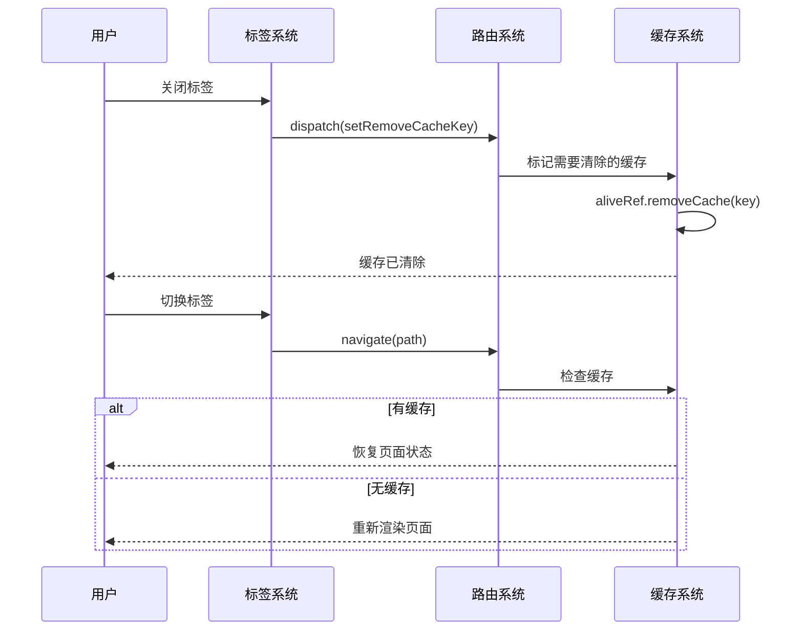

# 标签页管理

标签页(Tab)管理是 skyroc-admin 的核心功能之一,提供了多标签页浏览、标签操作、右键菜单、标签缓存等完整的标签页管理方案。

## 概述

标签页系统基于 Redux 进行状态管理,结合路由系统实现了页面级的多标签浏览体验。主要特性包括:

- **多标签浏览**: 支持同时打开多个页面,通过标签页快速切换
- **标签操作**: 关闭当前、关闭其他、关闭左侧、关闭右侧、关闭全部
- **右键菜单**: 右键点击标签显示操作菜单
- **固定标签**: 支持固定首页等重要页面,防止误关闭
- **标签缓存**: 支持刷新后恢复标签页状态
- **标签滚动**: 自动滚动到激活的标签页
- **动态标题**: 支持动态修改标签页标题
- **页面缓存集成**: 与路由缓存系统集成,实现页面状态保持

## 架构设计



## 核心类型定义

### Tab 类型

```ts
type Tab = {
  /** 标签页 ID */
  id: string;
  /** 路由路径 */
  routePath: string;
  /** 路由完整路径(含查询参数) */
  fullPath: string;
  /** 标签标题 */
  label: string;
  /** 国际化 key */
  i18nKey?: string | null;
  /** 图标(Iconify) */
  icon?: string;
  /** 本地图标 */
  localIcon?: string;
  /** 是否启用 KeepAlive 缓存 */
  keepAlive: boolean;
  /** 路由 key */
  routeKey: string;
  /** 固定位置索引 */
  fixedIndex?: number | null;
  /** 新标签标题(动态修改后的) */
  newLabel?: string;
  /** 原始标签标题 */
  oldLabel?: string | null;
};
```

### 标签操作类型

```ts
type DropdownKey = 'closeCurrent' | 'closeOther' | 'closeLeft' | 'closeRight' | 'closeAll';
```

### 标签事件枚举

```ts
enum TabEvent {
  /** 更新标签页 */
  UPDATE_TABS = 'UPDATE_TABS',
  /** 关闭当前标签 */
  CLOSE_CURRENT = 'CLOSE_CURRENT',
  /** 关闭其他标签 */
  CLOSE_OTHER = 'CLOSE_OTHER',
  /** 清除左侧标签 */
  CLEAR_LEFT_TABS = 'CLEAR_LEFT_TABS',
  /** 清除右侧标签 */
  CLEAR_RIGHT_TABS = 'CLEAR_RIGHT_TABS',
  /** 关闭全部标签 */
  CLOSE_ALL = 'CLOSE_ALL'
}
```

## Redux 状态管理

### 状态定义

```ts
interface TabState {
  /** 当前激活的标签页 ID */
  activeTabId: string;
  /** 标签页列表 */
  tabs: App.Global.Tab[];
  /** 当前激活的一级菜单 key */
  activeFirstLevelMenuKey: string;
  /** 需要删除的缓存页面路径 */
  removeCacheKey: string | null;
}
```

### Actions

#### addTab - 添加标签页

向标签列表中添加一个新标签。

```ts
import { addTab } from '@/features/tab/tabStore';
import { useAppDispatch } from '@/store';

function MyComponent() {
  const dispatch = useAppDispatch();

  const handleAddTab = () => {
    const tab: App.Global.Tab = {
      id: '/dashboard',
      routePath: '/dashboard',
      fullPath: '/dashboard',
      label: '仪表盘',
      i18nKey: 'route.dashboard',
      icon: 'mdi:monitor-dashboard',
      keepAlive: true,
      routeKey: 'dashboard',
      fixedIndex: 0
    };

    dispatch(addTab(tab));
  };
}
```

#### setTabs - 设置标签列表

完全替换当前的标签列表。

```ts
import { setTabs } from '@/features/tab/tabStore';

dispatch(setTabs([tab1, tab2, tab3]));
```

#### setActiveTabId - 设置激活标签

设置当前激活的标签页。

```ts
import { setActiveTabId } from '@/features/tab/tabStore';

dispatch(setActiveTabId('/dashboard'));
```

#### updateTab - 更新标签

更新指定位置的标签信息。

```ts
import { updateTab } from '@/features/tab/tabStore';

dispatch(updateTab({
  index: 0,
  tab: updatedTab
}));
```

#### changeTabLabel - 修改标签标题

动态修改标签的显示标题。

```ts
import { changeTabLabel } from '@/features/tab/tabStore';

// 设置新标题
dispatch(changeTabLabel({
  index: 0,
  label: '新标题'
}));

// 恢复原标题
dispatch(changeTabLabel({
  index: 0
}));
```

#### clearTabs - 清空标签

重置标签状态到初始值。

```ts
import { clearTabs } from '@/features/tab/tabStore';

dispatch(clearTabs());
```

### Selectors

#### selectTabs - 获取标签列表

```ts
import { selectTabs } from '@/features/tab/tabStore';
import { useAppSelector } from '@/store';

function MyComponent() {
  const tabs = useAppSelector(selectTabs);

  return (
    <div>
      {tabs.map(tab => (
        <div key={tab.id}>{tab.label}</div>
      ))}
    </div>
  );
}
```

#### selectActiveTabId - 获取激活标签 ID

```ts
import { selectActiveTabId } from '@/features/tab/tabStore';

const activeTabId = useAppSelector(selectActiveTabId);
```

#### selectActiveFirstLevelMenuKey - 获取激活菜单 Key

```ts
import { selectActiveFirstLevelMenuKey } from '@/features/tab/tabStore';

const activeMenuKey = useAppSelector(selectActiveFirstLevelMenuKey);
```

## 核心 Hooks

### useTabActions

提供标签页操作的核心方法。

```tsx
import { useTabActions } from '@/features/tab/tabHooks';

function MyComponent() {
  const {
    tabs,                    // 标签列表
    activeTabId,             // 当前激活的标签 ID
    removeTabById,           // 根据 ID 删除标签
    removeActiveTab,         // 删除当前激活标签
    isTabRetain,             // 判断标签是否为固定标签
    navigate                 // 路由跳转方法
  } = useTabActions();

  // 删除指定标签
  const handleRemoveTab = (tabId: string) => {
    if (!isTabRetain(tabId)) {
      removeTabById(tabId);
    }
  };

  // 删除当前标签
  const handleRemoveCurrent = () => {
    removeActiveTab();
  };

  return (
    <div>
      {tabs.map(tab => (
        <div key={tab.id}>
          <span>{tab.label}</span>
          {!isTabRetain(tab.id) && (
            <button onClick={() => handleRemoveTab(tab.id)}>关闭</button>
          )}
        </div>
      ))}
    </div>
  );
}
```

### useTabController

提供标签页的高级控制方法,通过事件总线方式操作标签。

```tsx
import { useTabController } from '@/features/tab/tabHooks';

function TabOperations() {
  const {
    closeCurrentTab,      // 关闭当前标签
    closeOtherTabs,       // 关闭其他标签
    clearLeftTabs,        // 清除左侧标签
    clearRightTabs,       // 清除右侧标签
    closeAllTabs          // 关闭所有标签
  } = useTabController();

  const currentTabId = '/dashboard';

  return (
    <div>
      <button onClick={() => closeCurrentTab(currentTabId)}>
        关闭当前
      </button>
      <button onClick={() => closeOtherTabs(currentTabId)}>
        关闭其他
      </button>
      <button onClick={() => clearLeftTabs(currentTabId)}>
        关闭左侧
      </button>
      <button onClick={() => clearRightTabs(currentTabId)}>
        关闭右侧
      </button>
      <button onClick={closeAllTabs}>
        关闭全部
      </button>
    </div>
  );
}
```

### useTabManager

自动管理标签页的生命周期,监听路由变化并自动添加/更新标签。

```tsx
import { useTabManager } from '@/features/tab/tabHooks';

function Layout() {
  // 在布局组件中使用,实现标签自动管理
  useTabManager();

  return (
    <div>
      <GlobalTab />
      <Outlet />
    </div>
  );
}
```

**工作原理**:

1. 监听路由变化(`useRoute`)
2. 检查当前路由是否已有标签
3. 如果没有则自动添加新标签
4. 如果已存在则更新标签信息
5. 自动设置激活状态
6. 在页面卸载前缓存标签列表

### useTabLabel

动态修改标签页标题。

```tsx
import { useTabLabel } from '@/features/tab/tabHooks';

function DynamicTitlePage() {
  const { setTabLabel, resetTabLabel } = useTabLabel();

  const handleChangeTitle = () => {
    // 修改当前标签标题
    setTabLabel('新的标题');

    // 修改指定标签标题
    setTabLabel('指定标题', '/dashboard');
  };

  const handleResetTitle = () => {
    // 恢复当前标签原始标题
    resetTabLabel();

    // 恢复指定标签原始标题
    resetTabLabel('/dashboard');
  };

  return (
    <div>
      <button onClick={handleChangeTitle}>修改标题</button>
      <button onClick={handleResetTitle}>恢复标题</button>
    </div>
  );
}
```

### useTabScroll

实现标签页的自动滚动定位功能。

```tsx
import { useTabScroll } from '@/features/tab/useTabScroll';

function TabBar({ activeTabId }: { activeTabId: string }) {
  const { bsWrapper, tabRef, setBsScroll } = useTabScroll(activeTabId);

  return (
    <div ref={bsWrapper}>
      <BetterScroll
        options={{ scrollX: true, scrollY: false }}
        setBsScroll={setBsScroll}
      >
        <div ref={tabRef}>
          {/* 标签列表 */}
        </div>
      </BetterScroll>
    </div>
  );
}
```

**特性**:

- 自动滚动到激活标签
- 居中显示激活标签
- 平滑滚动动画
- 响应式计算滚动距离

## 工具函数

### getTabByRoute

从路由对象创建标签页对象。

```ts
import { getTabByRoute } from '@/features/tab/shared';
import { useRoute } from '@/features/router';

function MyComponent() {
  const route = useRoute();
  const tab = getTabByRoute(route);

  console.log(tab);
  // {
  //   id: '/dashboard',
  //   routePath: '/dashboard',
  //   fullPath: '/dashboard',
  //   label: '仪表盘',
  //   i18nKey: 'route.dashboard',
  //   icon: 'mdi:monitor-dashboard',
  //   keepAlive: true,
  //   routeKey: 'dashboard',
  //   fixedIndex: 0
  // }
}
```

### isTabInTabs

判断标签是否在标签列表中。

```ts
import { isTabInTabs } from '@/features/tab/shared';

const exists = isTabInTabs('/dashboard', tabs);
// true or false
```

### getFixedTabs

获取所有固定标签。

```ts
import { getFixedTabs } from '@/features/tab/shared';

const fixedTabs = getFixedTabs(tabs);
// [{ id: '/dashboard', fixedIndex: 0, ... }]
```

### getFixedTabIds

获取所有固定标签的 ID 列表。

```ts
import { getFixedTabIds } from '@/features/tab/shared';

const fixedIds = getFixedTabIds(tabs);
// ['/dashboard', '/home']
```

### extractTabsByAllRoutes

根据路由名称列表过滤标签。

```ts
import { extractTabsByAllRoutes } from '@/features/tab/shared';

const filteredTabs = extractTabsByAllRoutes(['dashboard', 'user-list'], tabs);
```

## 标签缓存

### 缓存机制

标签页支持本地存储缓存,刷新页面后可恢复标签状态。



### 配置缓存

通过主题设置控制是否启用标签缓存:

```ts
// 在主题配置中
const themeSettings = {
  tab: {
    cache: true,  // 启用标签缓存
    height: 44,
    mode: 'chrome',
    visible: true
  }
};
```

### useCacheTabs

手动触发标签缓存。

```tsx
import { useCacheTabs } from '@/features/tab/tabHooks';

function MyComponent() {
  const cacheTabs = useCacheTabs();

  const handleSaveTabs = () => {
    // 手动缓存当前标签列表
    cacheTabs();
  };

  return (
    <button onClick={handleSaveTabs}>保存标签</button>
  );
}
```

### initTab

初始化标签,从缓存中恢复。

```ts
import { initTab } from '@/features/tab/tabHooks';

const updateTabs = (tabs) => {
  // 更新标签列表
};

// cache: 是否启用缓存
const cachedTabs = initTab(true, updateTabs);
```

## 右键菜单

### TabContextMenu 组件

标签页右键菜单组件,提供标签操作选项。

```tsx
import TabContextMenu from '@/features/tab/TabContextMenu';

function TabItem({ tab, active, disabledKeys }: TabItemProps) {
  return (
    <TabContextMenu
      tabId={tab.id}
      active={active}
      darkMode={darkMode}
      mode="chrome"
      disabledKeys={disabledKeys}
    >
      <div className="tab-content">
        {tab.label}
      </div>
    </TabContextMenu>
  );
}
```

### 菜单选项

| 选项 | Key | 图标 | 说明 |
|------|-----|------|------|
| 关闭当前 | closeCurrent | ant-design:close-outlined | 关闭当前标签 |
| 关闭其他 | closeOther | ant-design:column-width-outlined | 关闭其他所有标签 |
| 关闭左侧 | closeLeft | mdi:format-horizontal-align-left | 关闭左侧所有标签 |
| 关闭右侧 | closeRight | mdi:format-horizontal-align-right | 关闭右侧所有标签 |
| 关闭全部 | closeAll | ant-design:line-outlined | 关闭所有标签 |

### 禁用逻辑

```tsx
function getContextMenuDisabledKeys(tabId: string, index: number, tabs: Tab[]) {
  const disabledKeys: DropdownKey[] = [];

  // 固定标签不能关闭当前和关闭左侧
  if (isTabRetain(tabId)) {
    disabledKeys.push('closeCurrent', 'closeLeft');
  }

  // 第一个标签(固定标签)不能关闭左侧
  if (index === 0) {
    disabledKeys.push('closeLeft');
  }

  // 最后一个标签不能关闭右侧
  if (index === tabs.length - 1) {
    disabledKeys.push('closeRight');
  }

  return disabledKeys;
}
```

## GlobalTab 组件

主标签栏组件,是标签页系统的 UI 入口。

### 组件结构

```tsx
import GlobalTab from '@/features/tab/GlobalTab';

function Layout() {
  return (
    <div className="layout">
      <Header />
      <GlobalTab />
      <Content />
    </div>
  );
}
```

### 核心功能

1. **标签渲染**: 遍历标签列表渲染标签项
2. **标签点击**: 点击标签切换路由
3. **标签关闭**: 关闭标签并清理缓存
4. **右键菜单**: 集成 TabContextMenu
5. **自动滚动**: 集成 useTabScroll
6. **全屏切换**: 集成全屏按钮
7. **刷新按钮**: 集成页面刷新功能

### 关键代码

```tsx
function GlobalTab() {
  const { tabs, activeTabId, removeTabById, navigate, isTabRetain } = useTabActions();
  const { bsWrapper, setBsScroll, tabRef } = useTabScroll(activeTabId);

  useTabManager();

  // 关闭标签
  function handleCloseTab(tab: App.Global.Tab) {
    removeTabById(tab.id);
    // 清除页面缓存
    dispatch(setRemoveCacheKey(tab.routePath));
  }

  // 点击标签
  function handleClickTab(tab: App.Global.Tab) {
    navigate(tab.fullPath);
  }

  return (
    <div className="tab-bar">
      <div ref={bsWrapper}>
        <BetterScroll setBsScroll={setBsScroll}>
          <div ref={tabRef}>
            {tabs.map((tab, index) => (
              <TabContextMenu
                key={tab.id}
                tabId={tab.id}
                active={tab.id === activeTabId}
                disabledKeys={getDisabledKeys(tab.id, index)}
              >
                <PageTab
                  active={tab.id === activeTabId}
                  closable={!isTabRetain(tab.id)}
                  handleClose={() => handleCloseTab(tab)}
                  onClick={() => handleClickTab(tab)}
                >
                  {tab.label}
                </PageTab>
              </TabContextMenu>
            ))}
          </div>
        </BetterScroll>
      </div>
      <TabReloadButton />
      <FullScreenButton />
    </div>
  );
}
```

## 与路由缓存集成

标签页系统与路由缓存系统紧密集成,实现页面状态保持。

### 工作流程



### 示例代码

```tsx
import { setRemoveCacheKey } from '@/features/router/routeStore';
import { useAppDispatch } from '@/store';

function TabBar() {
  const dispatch = useAppDispatch();

  const handleCloseTab = (tab: App.Global.Tab) => {
    // 1. 从标签列表中移除
    removeTabById(tab.id);

    // 2. 如果页面启用了 keepAlive,清除缓存
    if (tab.keepAlive) {
      dispatch(setRemoveCacheKey(tab.routePath));
    }
  };
}
```

## 实际应用场景

### 1. 固定首页标签

```tsx
// 在路由配置中设置 fixedIndexInTab
export const routes = [
  {
    path: '/dashboard',
    component: Dashboard,
    meta: {
      title: '仪表盘',
      fixedIndexInTab: 0,  // 固定在第一个位置
      keepAlive: true
    }
  }
];
```

### 2. 多实例标签

允许同一个路由打开多个标签(通过不同的查询参数)。

```tsx
// 在路由配置中设置 multiTab: true
export const routes = [
  {
    path: '/user/detail',
    component: UserDetail,
    meta: {
      title: '用户详情',
      multiTab: true,  // 支持多实例
      keepAlive: true
    }
  }
];

// 使用
router.push('/user/detail?id=1');  // 标签 1
router.push('/user/detail?id=2');  // 标签 2
// 会创建两个不同的标签
```

### 3. 动态标题

```tsx
function UserDetailPage() {
  const { setTabLabel, resetTabLabel } = useTabLabel();
  const { data: user } = useQuery(['user', id]);

  useEffect(() => {
    if (user) {
      // 动态设置标签标题为用户名
      setTabLabel(`用户详情 - ${user.name}`);
    }

    return () => {
      // 组件卸载时恢复原标题
      resetTabLabel();
    };
  }, [user]);

  return <div>{/* 页面内容 */}</div>;
}
```

### 4. 自定义标签操作

```tsx
function CustomTabOperations() {
  const { closeCurrentTab, closeOtherTabs } = useTabController();
  const { tabs, activeTabId } = useTabActions();

  // 关闭除固定标签外的所有标签
  const closeAllNonFixed = () => {
    const fixedIds = getFixedTabIds(tabs);
    const nonFixedTabs = tabs.filter(tab => !fixedIds.includes(tab.id));

    nonFixedTabs.forEach(tab => {
      closeCurrentTab(tab.id);
    });
  };

  // 批量关闭多个标签
  const closeTabs = (tabIds: string[]) => {
    tabIds.forEach(id => {
      closeCurrentTab(id);
    });
  };

  return (
    <div>
      <button onClick={closeAllNonFixed}>关闭非固定标签</button>
      <button onClick={() => closeTabs(['/page1', '/page2'])}>
        批量关闭
      </button>
    </div>
  );
}
```

### 5. 标签拖拽排序

虽然当前版本未内置拖拽功能,但可以通过第三方库实现:

```tsx
import { DndContext, closestCenter } from '@dnd-kit/core';
import { arrayMove, SortableContext, useSortable } from '@dnd-kit/sortable';

function DraggableTabs() {
  const { tabs } = useTabActions();
  const updateTabs = useUpdateTabs();

  const handleDragEnd = (event: DragEndEvent) => {
    const { active, over } = event;

    if (active.id !== over?.id) {
      const oldIndex = tabs.findIndex(tab => tab.id === active.id);
      const newIndex = tabs.findIndex(tab => tab.id === over?.id);

      const newTabs = arrayMove(tabs, oldIndex, newIndex);
      updateTabs(newTabs);
    }
  };

  return (
    <DndContext collisionDetection={closestCenter} onDragEnd={handleDragEnd}>
      <SortableContext items={tabs.map(tab => tab.id)}>
        {tabs.map(tab => (
          <SortableTab key={tab.id} tab={tab} />
        ))}
      </SortableContext>
    </DndContext>
  );
}
```

## 最佳实践

### 1. 合理设置固定标签

只固定最重要的页面,避免固定过多标签影响用户体验:

```ts
// 推荐:只固定首页
fixedIndexInTab: 0  // 首页

// 不推荐:固定过多页面
fixedIndexInTab: 0  // 首页
fixedIndexInTab: 1  // 仪表盘
fixedIndexInTab: 2  // 工作台
// ...过多固定标签
```

### 2. 合理使用 KeepAlive

只对需要保持状态的页面启用 `keepAlive`:

```ts
// 适合启用 keepAlive 的场景:
// - 列表页(保持滚动位置、筛选条件)
// - 表单页(保持填写内容)
// - 复杂交互页面

// 不适合启用 keepAlive 的场景:
// - 详情页(数据可能过期)
// - 静态展示页面
```

### 3. 监控标签数量

避免打开过多标签导致性能问题:

```tsx
function TabLimitGuard() {
  const { tabs } = useTabActions();
  const MAX_TABS = 20;

  useEffect(() => {
    if (tabs.length > MAX_TABS) {
      message.warning(`标签页过多(${tabs.length}),建议关闭一些标签页`);
    }
  }, [tabs.length]);

  return null;
}
```

### 4. 清理无效标签

在路由权限变化时,清理用户无权访问的标签:

```tsx
function useCleanInvalidTabs() {
  const { tabs } = useTabActions();
  const { hasAuth } = useAuth();
  const { closeCurrentTab } = useTabController();

  useEffect(() => {
    // 检查所有标签,关闭无权访问的标签
    tabs.forEach(tab => {
      if (!hasAuth(tab.routeKey)) {
        closeCurrentTab(tab.id);
      }
    });
  }, [tabs]);
}
```

### 5. 标签持久化策略

根据场景选择合适的持久化策略:

```ts
// 场景1: 开发环境下不缓存,方便调试
const shouldCache = import.meta.env.PROD;

// 场景2: 根据用户设置决定是否缓存
const shouldCache = themeSettings.tab.cache;

// 场景3: 敏感页面不缓存
const shouldCacheTab = (tab: Tab) => {
  const sensitiveRoutes = ['/user/profile', '/settings'];
  return !sensitiveRoutes.includes(tab.routePath);
};
```

## 主题配置

### Tab 主题设置

```ts
interface ThemeTabSettings {
  /** 是否显示标签栏 */
  visible: boolean;
  /** 标签栏高度 */
  height: number;
  /** 标签模式 */
  mode: 'chrome' | 'button';
  /** 是否缓存标签 */
  cache: boolean;
}

// 默认配置
const defaultTabSettings: ThemeTabSettings = {
  visible: true,
  height: 44,
  mode: 'chrome',
  cache: true
};
```

### 标签模式

#### Chrome 模式

```tsx
// Chrome 浏览器风格,标签呈梯形
<PageTab mode="chrome" active={active}>
  Tab Content
</PageTab>
```

#### Button 模式

```tsx
// 按钮风格,标签呈矩形
<PageTab mode="button" active={active}>
  Tab Content
</PageTab>
```

## 性能优化

### 1. 虚拟滚动

当标签数量很多时,使用虚拟滚动优化性能:

```tsx
import { useVirtualizer } from '@tanstack/react-virtual';

function VirtualTabs() {
  const { tabs } = useTabActions();
  const parentRef = useRef<HTMLDivElement>(null);

  const rowVirtualizer = useVirtualizer({
    count: tabs.length,
    getScrollElement: () => parentRef.current,
    estimateSize: () => 120,
    horizontal: true
  });

  return (
    <div ref={parentRef} style={{ overflowX: 'auto' }}>
      <div style={{ width: `${rowVirtualizer.getTotalSize()}px` }}>
        {rowVirtualizer.getVirtualItems().map(virtualItem => {
          const tab = tabs[virtualItem.index];
          return (
            <div key={tab.id} style={{ transform: `translateX(${virtualItem.start}px)` }}>
              <PageTab>{tab.label}</PageTab>
            </div>
          );
        })}
      </div>
    </div>
  );
}
```

### 2. 懒加载标签内容

```tsx
function LazyTabContent({ tab }: { tab: Tab }) {
  const [isVisible, setIsVisible] = useState(false);

  useEffect(() => {
    const observer = new IntersectionObserver(
      ([entry]) => {
        if (entry.isIntersecting) {
          setIsVisible(true);
          observer.disconnect();
        }
      },
      { threshold: 0.1 }
    );

    const element = document.getElementById(tab.id);
    if (element) observer.observe(element);

    return () => observer.disconnect();
  }, [tab.id]);

  return isVisible ? <ActualTabContent tab={tab} /> : <TabSkeleton />;
}
```

### 3. 缓存限制

限制 KeepAlive 缓存数量:

```tsx
import { KeepAlive } from 'keepalive-for-react';

function CachedRoutes() {
  const cacheRoutes = useAppSelector(selectCacheRoutes);

  return (
    <KeepAlive
      include={cacheRoutes}
      max={10}  // 最多缓存 10 个页面
      strategy="LRU"  // 使用 LRU 策略
    >
      <Outlet />
    </KeepAlive>
  );
}
```

## 相关文件

- **tabStore.ts**: Redux 标签状态管理 (`/src/features/tab/tabStore.ts:1`)
- **tabHooks.ts**: 标签操作 Hooks (`/src/features/tab/tabHooks.ts:1`)
- **GlobalTab.tsx**: 全局标签栏组件 (`/src/features/tab/GlobalTab.tsx:1`)
- **TabContextMenu.tsx**: 右键菜单组件 (`/src/features/tab/TabContextMenu.tsx:1`)
- **useTabScroll.ts**: 标签滚动 Hook (`/src/features/tab/useTabScroll.ts:1`)
- **shared.ts**: 标签工具函数 (`/src/features/tab/shared.ts:1`)
- **tabEnum.ts**: 标签事件枚举 (`/src/features/tab/tabEnum.ts:1`)

## 相关文档

- [路由系统](../routes/page.mdx) - 路由基础功能
- [路由缓存](../routes/cache/page.mdx) - 页面缓存机制
- [路由状态管理](../routes/store/page.mdx) - 路由状态管理

## 总结

标签页管理系统提供了完整的多标签浏览解决方案:

- 基于 Redux 的状态管理
- 丰富的标签操作方法
- 右键菜单快捷操作
- 固定标签防止误关闭
- 标签缓存持久化
- 自动滚动定位
- 动态标题修改
- 与路由缓存深度集成
- 支持多实例标签
- Chrome/Button 两种显示模式
- 完善的性能优化方案

通过合理使用标签页系统,可以为用户提供流畅的多任务浏览体验。
