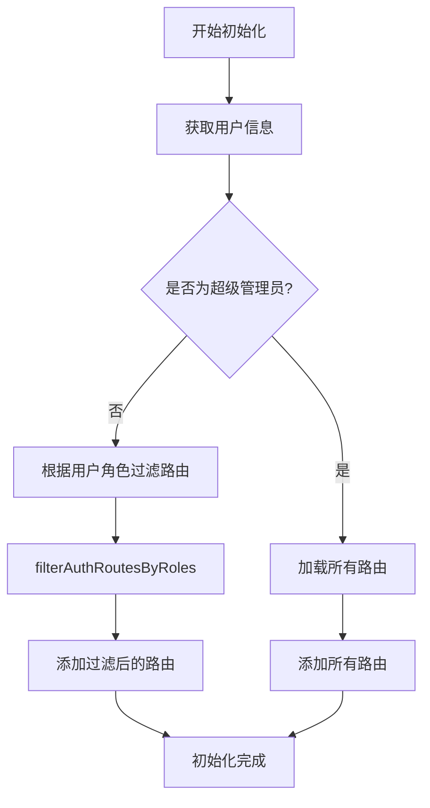
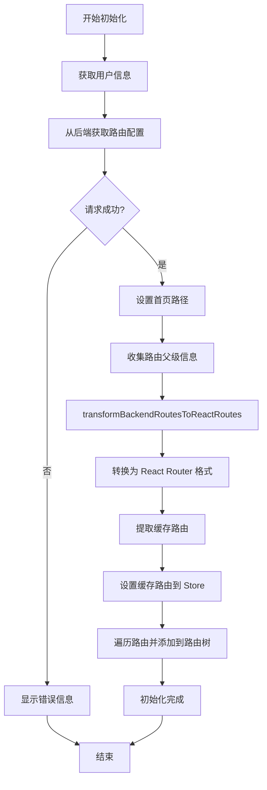

# 路由初始化

路由初始化是应用启动过程中的关键步骤,它负责根据用户的权限动态加载和配置路由。本框架支持**静态路由模式**和**动态路由模式**两种方式。

## 路由模式

通过环境变量 `VITE_AUTH_ROUTE_MODE` 来控制路由模式:

- **static**: 静态路由模式,路由配置直接定义在前端代码中
- **dynamic**: 动态路由模式,路由配置从后端接口获取

## 初始化流程

### initAuthRoutes 函数

`initAuthRoutes` 是路由初始化的核心函数,它根据配置的路由模式和用户权限动态加载路由。

```ts
export async function initAuthRoutes(
  addRoutes: (parent: string | null, route: RouteObject[]) => void
)
```

#### 参数说明

- **addRoutes**: 路由补丁函数,用于动态添加路由到路由树中
  - `parent`: 父路由的名称,如果为 `null` 则添加到根路由
  - `route`: 要添加的路由对象数组

## 静态路由模式

### 工作原理

在静态路由模式下,路由配置直接定义在前端代码中(`@/router` 中的 `authRoutes`),初始化时根据用户角色过滤可访问的路由。

### 流程图



### 代码实现

```ts
// 静态模式
if (authRouteMode === 'static') {
  const userInfo = await queryClient.ensureQueryData<Api.Auth.UserInfo>({
    queryFn: fetchGetUserInfo,
    queryKey: QUERY_KEYS.AUTH.USER_INFO
  });

  const isSuper = userInfo?.roles.includes(import.meta.env.VITE_STATIC_SUPER_ROLE);

  // 超级管理员
  if (isSuper) {
    reactAuthRoutes.forEach(route => {
      addRoutes(route.parent, route.route);
    });
  } else {
    // 非超级管理员 - 根据角色过滤路由
    const filteredRoutes = filterAuthRoutesByRoles(
      reactAuthRoutes,
      userInfo?.roles || []
    );

    filteredRoutes.forEach(({ parent, route }) => {
      addRoutes(parent, route);
    });
  }
}
```

### 角色权限过滤

`filterAuthRoutesByRoles` 函数负责根据用户角色过滤路由:

```ts
export function filterAuthRoutesByRoles(
  routes: { parent: string | null; route: RouteObject[] }[],
  roles: string[]
)
```

**过滤规则**:
- 如果路由的 `handle.roles` 为空,表示无需权限,所有用户都可访问
- 如果用户角色包含在路由的 `handle.roles` 中,则允许访问
- 否则该路由将被过滤掉

## 动态路由模式

### 工作原理

在动态路由模式下,路由配置从后端接口获取,前端将后端返回的路由数据转换为 React Router 的路由格式。

### 流程图



### 代码实现

```ts
// 动态模式
else {
  try {
    // 1. 获取后端路由数据
    const data = await queryClient.ensureQueryData<Api.Route.BackendRouteResponse>({
      gcTime: Infinity,
      queryFn: fetchGetBackendRoutes,
      queryKey: QUERY_KEYS.ROUTE.USER_ROUTES,
      staleTime: Infinity
    });

    // 2. 设置首页路径
    store.dispatch(setHomePath(data.home));

    // 3. 收集路由父级信息
    const routeParentMap = new Map<string, string | null>();

    function collectParentInfo(routes: Api.Route.BackendRoute[], parent: string | null = null) {
      routes.forEach(route => {
        const routeParent = route.layout !== undefined ? route.layout : parent;
        routeParentMap.set(route.name, routeParent ?? null);
      });
    }

    collectParentInfo(data.routes, '(base)');

    // 4. 转换后端路由为 React Router 格式
    const { cacheRoutes, routes: reactRoutes } = transformBackendRoutesToReactRoutes(data.routes);

    // 5. 设置缓存路由
    if (cacheRoutes.length > 0) {
      store.dispatch(setCacheRoutes(cacheRoutes));
    }

    // 6. 添加路由到路由树
    reactRoutes.forEach(routeArray => {
      const parent = routeParentMap.get(routeArray.id as string);
      if (parent) {
        addRoutes(parent, [routeArray]);
      } else {
        addRoutes(null, [routeArray]);
      }
    });
  } catch (error) {
    console.error('Failed to initialize auth routes:', error);
    window.$message?.error('路由初始化失败，请刷新页面重试');
  }
}
```

### 后端路由数据格式

```ts
interface BackendRouteResponse {
  // 首页路径
  home: string;
  // 路由配置数组
  routes: BackendRoute[];
}

interface BackendRoute {
  // 路由名称
  name: string;
  // 路由路径
  path: string;
  // 组件名称 (如 'page.Dashboard')
  component?: string;
  // 布局名称 (如 'layout.Base')
  layout?: string;
  // 重定向路径
  redirect?: string;
  // 路由元信息
  handle?: RouteMeta;
  // 父路由名称
  parent?: string;
  // 子路由
  children?: BackendRoute[];
}
```

## 路由补丁机制

### patchRoutesOnNavigation

路由初始化使用了 React Router 的 `patchRoutesOnNavigation` 特性,实现按需加载认证路由:

```ts
const reactRouter = routerCreator(routes, {
  basename: import.meta.env.VITE_BASE_URL,
  patchRoutesOnNavigation: async ({ patch, path }) => {
    if (getIsNeedPatch(path)) {
      isAlreadyPatch = true;
      await initAuthRoutes(patch);
    }
  }
});
```

### 工作原理

1. **懒加载**: 只有在用户首次访问需要认证的路由时,才会加载认证路由
2. **避免重复**: 使用 `isAlreadyPatch` 标记确保路由只初始化一次
3. **智能判断**: `getIsNeedPatch` 函数判断是否需要加载认证路由
   - 未登录用户不需要加载
   - 已经加载过不需要重复加载
   - 访问的路由不存在或为 404 时才需要加载

```ts
function getIsNeedPatch(path: string) {
  // 未登录,不需要补丁
  if (!getIsLogin(store.getState())) return false;

  // 已经打补丁,不需要再次补丁
  if (isAlreadyPatch) return false;

  // 检查路由是否匹配
  const matchRoute = matchRoutes(routes, { pathname: path }, import.meta.env.VITE_BASE_URL);

  // 路由不存在,需要补丁
  if (!matchRoute) return true;

  // 如果匹配到的是 404 路由,需要补丁
  if (matchRoute) {
    return matchRoute[1].route.path === '*';
  }

  return false;
}
```

## 初始缓存路由

除了动态加载的认证路由,框架还支持初始化时设置缓存路由:

```ts
// 在路由初始化时设置初始缓存路由
store.dispatch(setCacheRoutes(initCacheRoutes));
```

`initCacheRoutes` 通常包含登录页等常量路由的缓存配置。

## 最佳实践

### 1. 静态路由模式

适用场景:
- 路由结构简单且固定
- 不需要频繁修改路由配置
- 希望在前端完全控制路由

优势:
- 无需后端接口支持
- 路由配置直观,易于维护
- 加载速度快

### 2. 动态路由模式

适用场景:
- 需要根据不同用户动态配置路由
- 路由结构复杂且需要灵活调整
- 需要在运行时动态修改路由配置

优势:
- 灵活性强,支持动态配置
- 可以根据用户权限精确控制路由
- 便于实现多租户系统

### 3. 错误处理

在动态路由模式下,建议完善错误处理:

```ts
try {
  await initAuthRoutes(patch);
} catch (error) {
  // 记录错误日志
  console.error('Failed to initialize auth routes:', error);

  // 显示用户友好的错误信息
  window.$message?.error('路由初始化失败，请刷新页面重试');

  // 可选: 跳转到错误页面
  // router.push('/error');
}
```

## 相关文件

- **initRouter.ts**: 路由初始化逻辑 (`/src/features/router/initRouter.ts:1`)
- **shared.ts**: 路由转换工具函数 (`/src/features/router/shared.ts:1`)
- **routeStore.ts**: 路由状态管理 (`/src/features/router/routeStore.ts:1`)

## 总结

路由初始化是应用的关键环节,通过支持静态和动态两种模式,框架能够适应不同的业务场景:

- 静态模式适合路由结构固定的应用
- 动态模式适合需要灵活配置路由的应用
- 两种模式都支持基于角色的权限控制
- 使用路由补丁机制实现按需加载,优化应用性能
